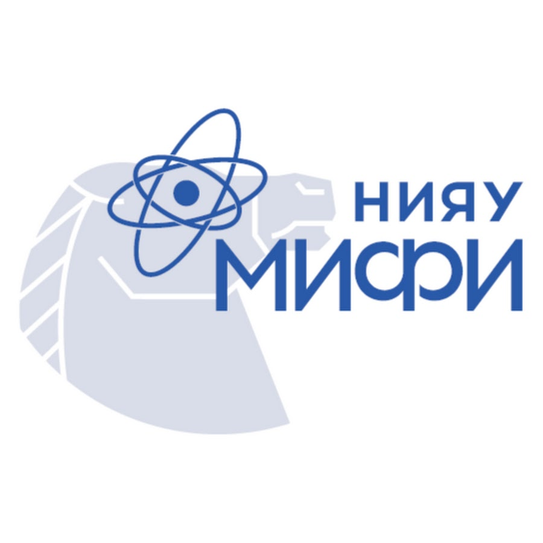
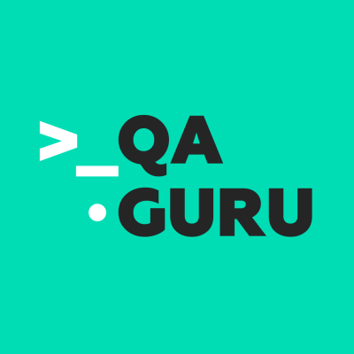
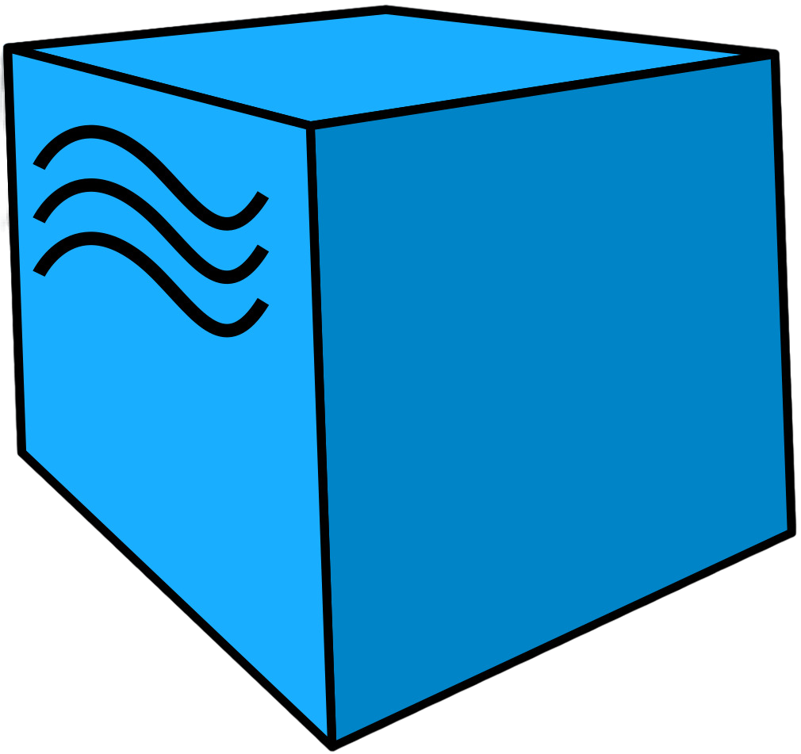
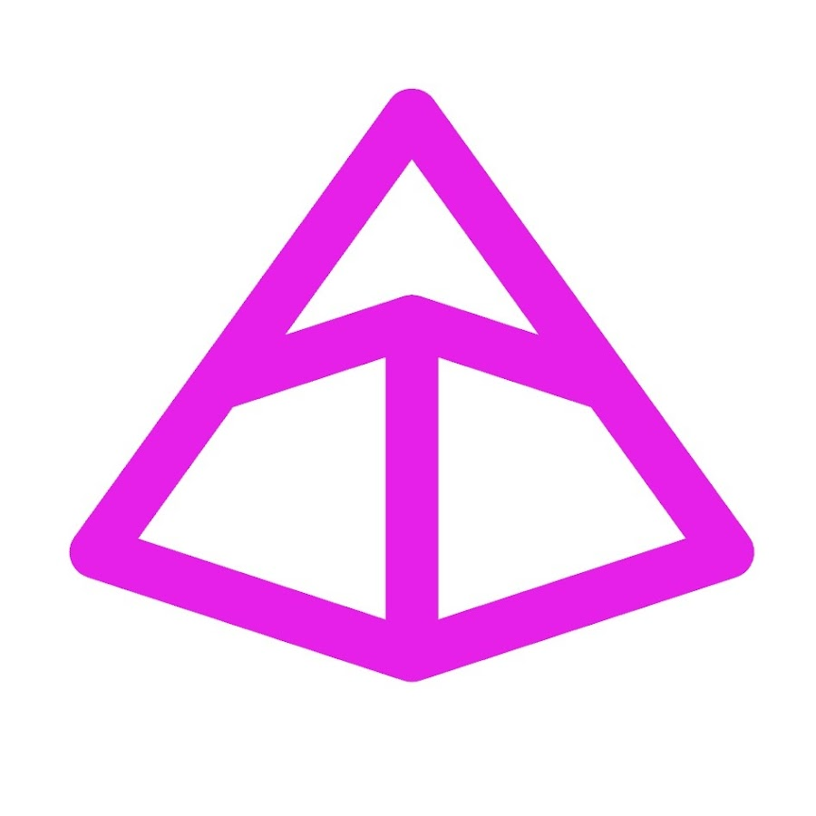

<h1 align="center">Hi there 👋, I'm Zaur</h1>

I am QA Engineer from 2020.

---

### :mortar_board: Education

<table width="100%" border='0'>
    <tr><td width="10%" valign="bottom"></td><td valign="middle">National Research Nuclear University MEPhI (Moscow Engineering Physics Institute) Faculty of Physics and Technology</td></tr>
    <tr><td width="10%" valign="bottom"></td><td valign="middle">QA Guru Автоматизация тестирования на Python</td></tr>
</table>

### Languages and tools

#### Languages & Core Frameworks

#### Web UI Automation

#### API Testing & Validation

#### Infrastructure & CI/CD

#### Database & Management

---

### 📊 Statistics

